<p align="center">
  
</p>

# 🚀 Hosting a Static Website with AWS S3

**🔗 Live Demo (if enabled):** http://bao-s3-static-web-project.s3-website.us-east-2.amazonaws.com  
**👤 Author:** Bao Luong  
**📧 Email:** baodevops21@gmail.com

---

## 📚 Overview

This project demonstrates how to host a static website using **Amazon S3** with publicly accessible HTML content. I used AWS's simple S3 interface to serve a static `index.html` file and images. I encountered and resolved a `403 Forbidden` error, learned to configure permissions using both **ACLs** and **bucket policies**, and gained a better understanding of S3’s public access settings.

---

## 🧰 Tools & Services

- **Amazon S3**
- **Bucket Policies & ACLs**
- **AWS Console**
- **Static Website Hosting**
- **Ohio (us-east-2) Region**

---

## 📸 Step-by-Step Screenshots

### 1. Search and Select S3 from the AWS Console
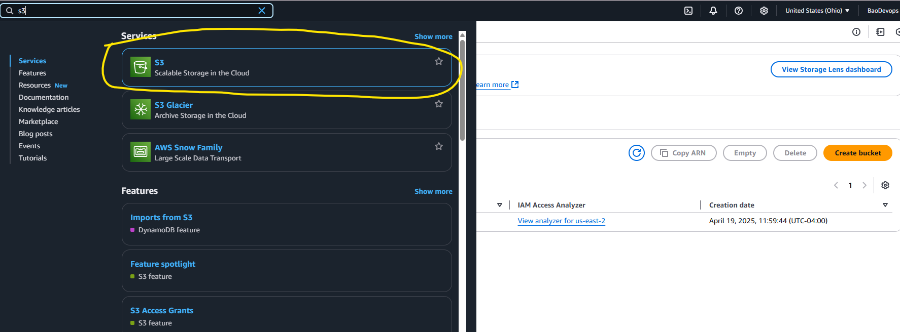

### 2. Create a Bucket in the Closest Region
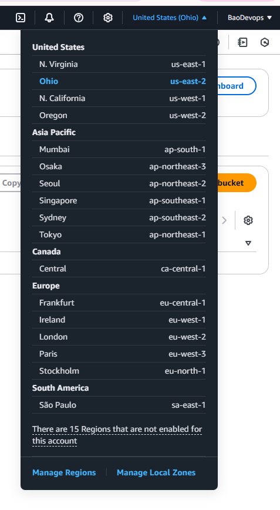

### 3. Upload Files (HTML + Image Assets)
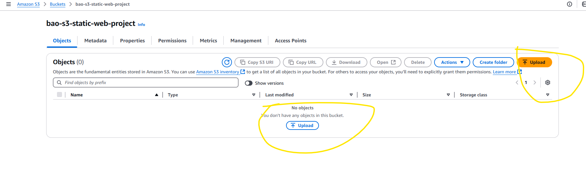  
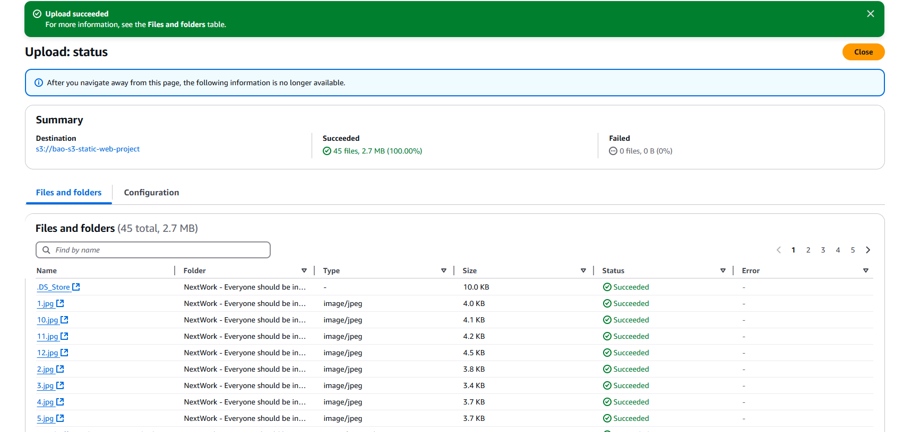

### 4. Enable Static Website Hosting
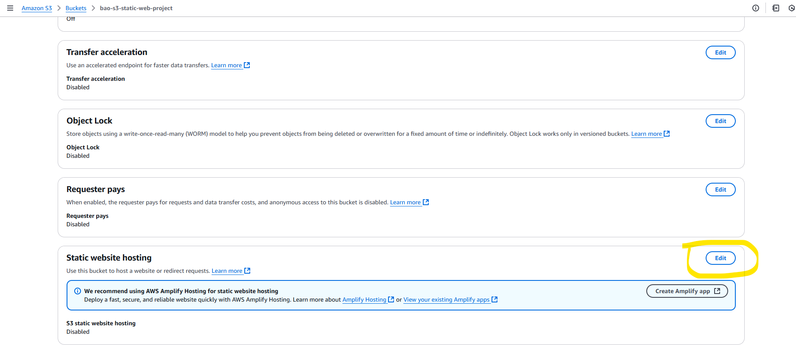  
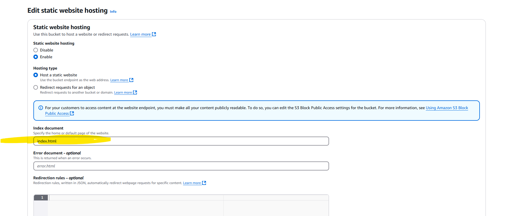

### 5. Adjust Public Access Settings
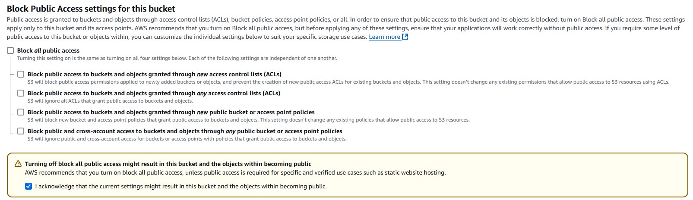

### 6. Make Website Files Public Using ACL
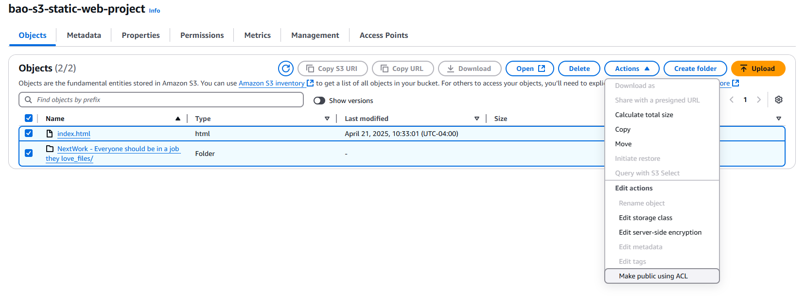

### 7. View Your Live Website
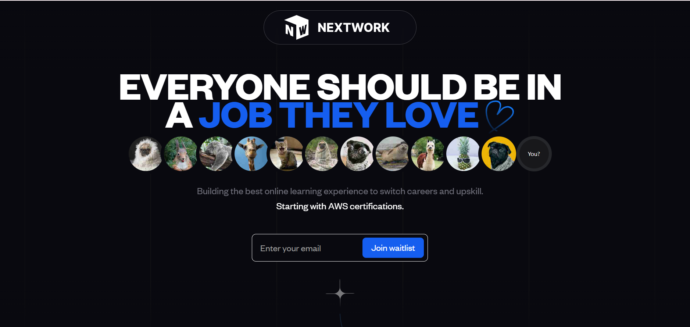

### 8. Understand Bucket Ownership & ACL Settings
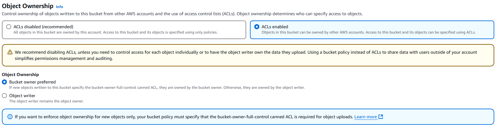

### 9. Add Bucket Policy to Prevent File Deletion
```json
{
  "Version": "2012-10-17",
  "Id": "MyBucketPolicy",
  "Statement": [
    {
      "Sid": "BucketPutDelete",
      "Effect": "Deny",
      "Principal": "*",
      "Action": "s3:DeleteObject",
      "Resource": "arn:aws:s3:::bao-s3-static-web-project/index.html"
    }
  ]
}
```
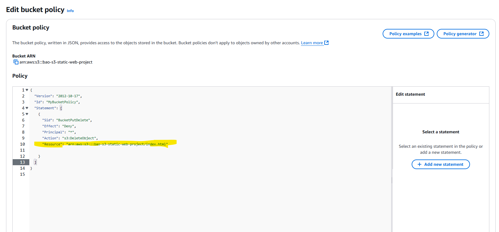

### 10. Confirm Deletion Denied (403)
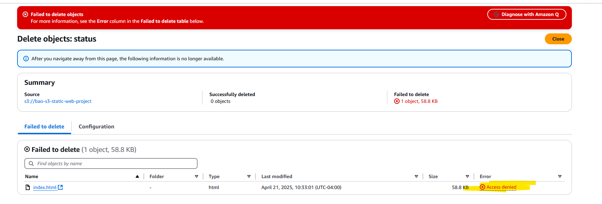

### 11. (Issue) Fix 403 Forbidden Error
If you visit your S3 endpoint and get this:


### 12. Explore the Objects Panel
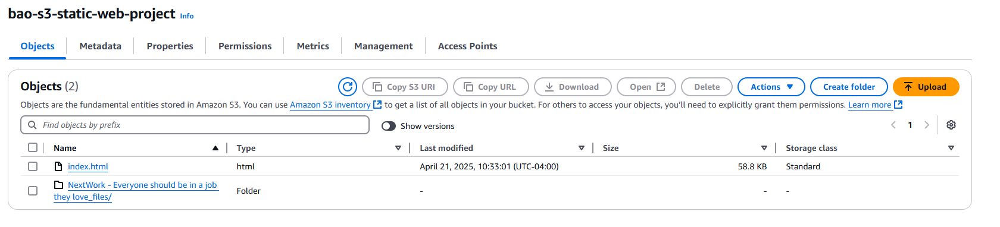

### 13. General Purpose Bucket View
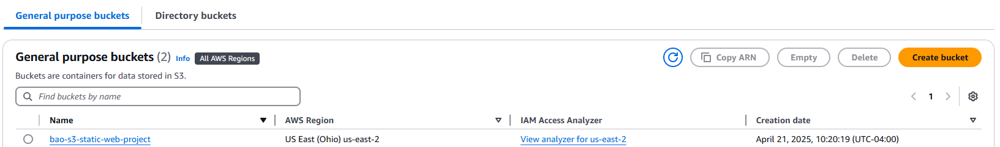

### 14. Check All Public Settings


### 15. Final Screenshot Overview


✅ Check that:
- Public access settings are disabled
- Files are public (ACL or bucket policy)
- The `index.html` is present at the root of the bucket

---

## ✅ Final Reflection

> “This project was simple yet powerful. It took about 45 minutes and taught me how AWS handles object permissions. Debugging the 403 Forbidden error helped me understand S3's access controls in depth.”

---

## 🗂 Project Structure

```
bao-s3-static-web-project/
├── index.html
├── assets/
│   └── *.jpg
├── screenshots/
│   └── *.png (15 images from this walkthrough)
└── README.md
```

---

## 📌 Related

- [AWS S3 Docs](https://docs.aws.amazon.com/AmazonS3/latest/userguide/WebsiteHosting.html)
- [NextWork Project](http://learn.nextwork.org/projects/aws-host-a-website-on-s3)

---

## ✨ Star This Repo

If you found this helpful, give this repo a ⭐️ and connect with me on [LinkedIn](https://www.linkedin.com/in/baoluongdevops)!
